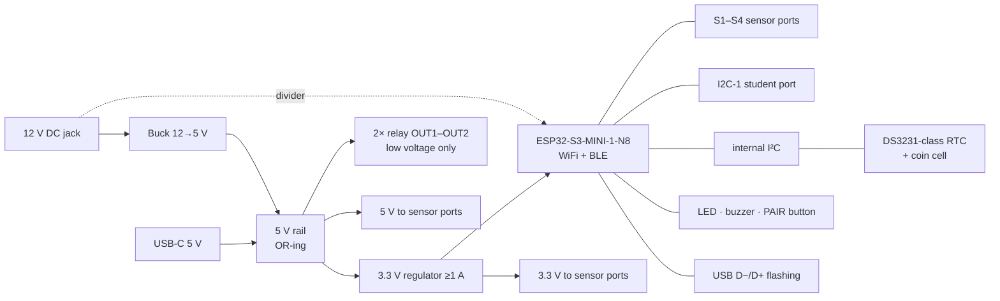
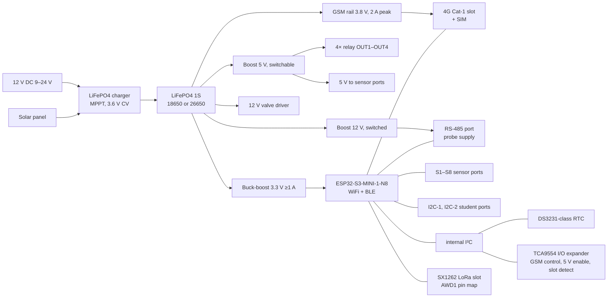

# ASC Student Kit: Architecture (v0.1, studio stage 3)

**Follows from:** `StudentKit_Specification_v0.1.md` (stage 2). Requirement IDs (SYS-, HW-, SW-, APP-) refer to that document.
**Machine-readable pin map:** `../hardware/pinmap.json`, checked by `../hardware/tools/check_pinmap.py`
**Date:** 7 Oct 2026. **Status:** draft for review (the stage-3 gate).

This is studio stage 3 run on our own kits. The pin map is a data file, and a rule checker enforces the hardware rules. This is the same split the studio will use for students: the AI proposes, the rules decide (studio decision D5). Every power and battery figure below is an **estimate from typical datasheet values**. Bring-up measurements replace them in stage 6.

---

## 1. Block diagrams

### Mini



### Mega



The valve driver needs 12 V. On battery power it runs from the 12 V boost. Exactly how that rail is shared is decided at schematic time.

## 2. Pin map (ESP32-S3-MINI-1-N8)

The module is the **-N8 variant** (8 MB flash, no PSRAM), the same part as AWD1. This variant leaves GPIO26 and GPIO33–37 free. A variant with octal PSRAM would lose GPIO33–37 and break this map.

| GPIO | Mini | Mega | Why this pin |
|---|---|---|---|
| 0 | PAIR/BOOT button | PAIR/BOOT button | Strapping pin; the button pulls it low for download mode |
| 1–4 | **S1–S4** | **S1–S4** | ADC1 channels 0–3: analog reads work with WiFi/BLE on (HW-04) |
| 5–8 | spare | **S5–S8** | ADC1 channels 4–7 |
| 9 | spare | VBAT_ADC | ADC1 channel 8 |
| 10 | VIN_SENSE (12 V present) | VIN_SENSE (12 V / solar) | ADC1 channel 9 — the last ADC1 channel |
| 11 | BOARD_ID | BOARD_ID | ADC2. Read once at boot, before the radio starts (HW-12) |
| 12 / 13 | internal I²C SDA / SCL | internal I²C SDA / SCL | RTC, I/O expander (Mega), OLED header |
| 14 / 15 | student I²C SDA / SCL | student I²C SDA / SCL (both ports) | A separate bus, so a student module can never clash with the RTC's address (0x68) |
| 16 | RTC_INT | RTC_INT | RTC alarm can wake the board from deep sleep |
| 17 / 18 / 21 | spare | LoRa DIO1 / BUSY / RST | Same as AWD1, checked automatically against its `design.py` |
| 19 / 20 | USB D− / D+ | USB D− / D+ | Native USB: flashing and the serial console |
| 26 | spare | PROBE_PWR_EN (12 V RS-485 probe) | Free only on the -N8 module |
| 33 / 34 | spare | RS-485 TX / RX | The transceiver switches direction automatically (HW-08) |
| 35 / 36 | **OUT1 / OUT2** | **OUT1 / OUT2** | The same pins on both boards (SYS-01) |
| 37 / 38 | spare | **OUT3 / OUT4** | |
| 39–42 | spare | LoRa NSS / SCK / MOSI / MISO | Same as AWD1 |
| 43 / 44 | debug UART pads | GSM TX / RX | On Mega, logs go over USB instead |
| 45 | — | VBAT_EN | Strapping pin that must read 0 at reset. Its load has a pull-down, as on AWD1 |
| 46 | BUZZER | BUZZER | Strapping pin that must read 0 at reset. Driven through a MOSFET whose gate has a pull-down |
| 47 | spare | VALVE (12 V MOSFET) | |
| 48 | LED | LED | |

**Mega uses all 39 of the module's GPIOs.** The I/O expander (TCA9554 on the internal I²C bus, address 0x20) carries the slow signals:

| Pin | Signal |
|---|---|
| P0 | GSM_PWRKEY |
| P1 | GSM_STATUS |
| P2 | SENSOR_5V_EN (turns off 5 V to the sensors between readings on battery) |
| P3 | LoRa slot fitted |
| P4 | GSM slot fitted |
| P5–P7 | spare |

**Mini leaves 19 GPIOs free.** Port pins stay at the same GPIO on both boards, so Mini rev B could add ports S5–S8 without any firmware change.

`check_pinmap.py` enforces these rules and fails if any is broken:
- no pin is used twice;
- every pin exists on the module;
- the USB pins are used only for USB;
- every sensor port is on ADC1;
- GPIO45 and GPIO46 are pulled down at boot;
- shared signals sit on the same GPIO on both boards;
- port numbering has no gaps;
- the LoRa pins match AWD1.

## 3. Connectors

| Port | Connector | Pins | Notes |
|---|---|---|---|
| Sensor ports S1… | 4-pin JST-XH 2.54 mm (polarised, so it cannot be plugged in backwards) | 1 GND · 2 3V3 · 3 5V · 4 SIG | Each block uses the supply it needs. Both supplies have a resettable fuse. The SIG input is protected by a series resistor and clamp diodes, so a 5 V *digital* signal is safe (for example a flow sensor). A 0–5 V *analog* signal needs a divider, which is part of that block's adapter cable. |
| I²C ports | 4-pin, **Grove-compatible** pinout (GND · 3V3 · SDA · SCL) | | Grove and Qwiic I²C modules (with an adapter cable) plug straight in, which makes the block library cheaper |
| Relay OUT1… | 3-way 5.08 mm screw terminal (COM, NO, NC) | | Silkscreen: "LOW VOLTAGE ONLY" (HW-05) |
| RS-485 (Mega) | 4-way screw terminal (A, B, +12 V switched, GND) | | |
| Valve (Mega) | 2-way screw terminal | | |
| Power | 12 V DC barrel jack; Mega adds a 2-way solar terminal | | |
| USB-C | USB-C receptacle, 5.1 kΩ CC pull-downs | | |

Proposed: the sensor ports stay 4-pin, not the 3-pin in the spec draft. The extra pin carries 5 V, which flow sensors and 5 V ultrasonic sensors need.

## 4. Power

### Mini power tree and budget

| Rail | Source | Loads | Estimated peak |
|---|---|---|---|
| 5 V | USB-C or 12 V→5 V buck (OR-ed) | 3.3 V regulator input, 2 relays (≈75 mA each), 5 V sensors | ≈ 700 mA |
| 3.3 V | regulator rated ≥1 A | ESP32-S3 (WiFi TX peaks ≈ 350 mA), 3.3 V sensors, RTC, OLED | ≈ 450 mA |

**Rule for the studio:** a laptop USB port supplies only about 500 mA. With both relays and WiFi active, the board can brown out. If a design uses relays, the studio's checks (studio D5) ask for the **12 V adapter or a ≥1 A USB charger** and explain why in a "Why?" card.

### Mega power tree and budget

- **Battery:** LiFePO4 1S. The **14500 cell used on AWD1 is too small for Mega**: GSM peaks alone are 1–2 A. Proposed cell: an **18650 (≈1.5 Ah)**, or a **26650 (≈3 Ah)** for GSM-heavy designs.
- **Charger:** a buck/MPPT charger that can be set for LiFePO4 (3.6 V constant voltage), fed by the 12 V input or the solar panel. The exact IC is chosen at the schematic stage.
- **System rails come from the battery:**
  - 3.3 V buck-boost (the cell voltage crosses 3.3 V);
  - 5 V boost, switched, for relays and 5 V sensors;
  - 3.8 V GSM rail (2 A peak, large bulk capacitor);
  - 12 V boost, switched, for RS-485 probes.
- **The firmware staggers big loads:** no GSM transmission while a relay is switching.

| Load | Typical | Peak |
|---|---|---|
| ESP32-S3, WiFi or BLE active | 80–120 mA | ≈ 350 mA |
| SX1262 transmitting at 22 dBm | — | ≈ 120 mA |
| 4G Cat-1 modem | ≈ 250 mA during a session | 1–2 A bursts |
| Relays (each, held on) | ≈ 75 mA at 5 V | |
| 8 sensors | ≈ 20 mA each | |
| Deep sleep, everything switched off | ≈ 0.1–0.25 mA | |

### Mega battery life (18650, 1.5 Ah, no solar, estimated)

| Use | Daily use | Life |
|---|---|---|
| Field node: wakes every 15 min, reads 4 sensors, sends over LoRa | ≈ 18 mAh | **≈ 2 months** |
| Same, plus an hourly 4G/SMS report | ≈ 50 mAh | **≈ 3–4 weeks** |
| One relay held ON continuously | ≈ 75 mA continuous | **≈ 17 hours** |

A 1–2 W solar panel covers the first two cases indefinitely. The third case is the important one: **a normal relay held ON drains the battery in under a day.** See decision A1 below.

## 5. Firmware architecture (one image for both boards)

```
boot → read BOARD_ID (ADC2, radio still off) → load board map from pinmap.json (compiled in)
     → load design config from NVS (SW-03) → check each block's port exists on this board (SW-02)
     → start drivers → start rule engine (RTC time, SW-12) → start links: BLE (SW-10), WiFi/MQTT, LoRa, GSM
```

- `pinmap.json` is converted into the firmware's board table at build time, so the firmware and the hardware cannot disagree.
- Each driver talks only to *ports* (S1, OUT2, I2C-1), never to GPIO numbers (SYS-04).
- The BLE service and MQTT carry the same messages: config, live values, commands, app layout. The app (APP-01) therefore uses one data model whichever link it is on.

## 6. Decisions needed at this gate

| # | Decision | Recommendation |
|---|---|---|
| A1 | **Relays on Mega under battery power.** A normal relay held ON drains the battery in about 17 hours. | Use **latching (bistable) relays on Mega**. They draw current only while switching. Drive their coils through a second I²C expander, because Mega has no free GPIOs. Mini keeps normal relays (it always has mains power). |
| A2 | Sensor port connector: 4-pin JST-XH with both 3.3 V and 5 V (§3) | Yes |
| A3 | Student I²C ports use the Grove pinout | Yes |
| A4 | Mega battery: 18650 (≈1.5 Ah) as standard, 26650 as an option for GSM-heavy designs | Yes |
| A5 | GSM slot uses a 4G Cat-1 modem, not 2G. Jio is 4G-only, and 2G networks are shrinking. | Yes |
| A6 | Module locked to ESP32-S3-MINI-1-**N8**, as AWD1 | Yes |

## 7. Notes for the studio templates

- The pin-map data file plus a checker worked well. The studio's architecture stage should do the same for student designs: assigning blocks to ports produces data, the rules check it, and the student sees plain-language errors ("S5 can't take an analog sensor while WiFi is on").
- The rule-check messages in `check_pinmap.py` are already written as explanations, not codes. Later they can feed the student-facing "Why?" cards.
