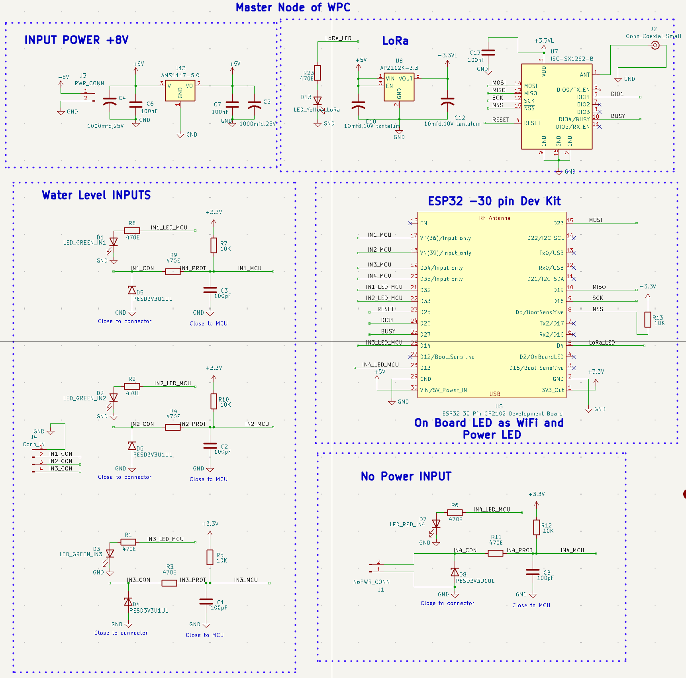
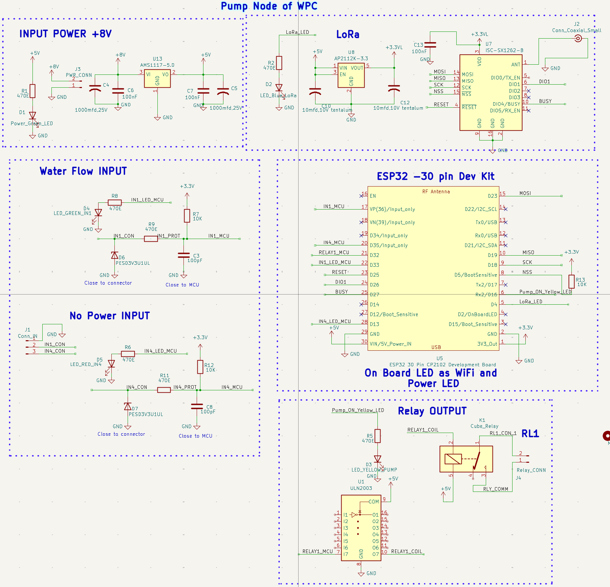

# Wireless Pump Controller (WPC) — System Specification (v0.2)

**Product:** Wireless Pump Controller (WPC)
**Platform:** Shared hardware platform with FM1 / WM1 (agritech-iot line)
**Radio:** LoRa (SX1262), ESP32 30-pin dev board on both nodes
**Repo:** `~/Projects/agritech-iot/products/WPC-pumpcontroller/` (`docs/`, `firmware/`, `hardware/`, `mobile-app/`)
**Date:** 15 Aug 2026 (rev 2 — incorporates schematic review + decisions)

---

## 1. Purpose

WPC maintains the water level of a **centralised sump** that is fed by **N pumps scattered around a field**. A single **Master Node** measures sump level (via float switches) and decides which remote pumps to turn ON/OFF, based on per-pump level assignments configured by the user. Each pump is switched by its own **Pump Node**, which talks to the Master over LoRa.

## 2. System Roles

### 2.1 Master Node
- Reads up to **3 water-level float switch inputs** (IN1–IN3) plus a separate **"No Power" input** (IN4) — see §3.1.
- Holds the level-to-pump assignment table.
- Sends ON/OFF commands to Pump Nodes over LoRa based on current level vs. each pump's assigned setpoint.
- Hosts a **SoftAP** for local status viewing (pump states, current level, last-seen times).
- Accepts new Pump Node registrations via the app.
- Has a unique **Master ID**, derived from the ESP32's MAC address — used during Pump Node pairing so co-located systems don't cross-talk.

### 2.2 Pump Node
- Switches one pump via a **relay dry contact to the pump's existing starter** (not direct motor switching) — see §3.2.
- Reads back pump run status via **one analog input** (fed from the starter side, not controlled by WPC logic).
- Joins a specific Master using that Master's MAC-derived ID, captured during provisioning via its own SoftAP.
- Executes ON/OFF commands received from its bound Master; fails safe to **OFF** if it loses contact with the Master.

### 2.3 App
- **Single common app**, used both by the owner/operator (status, level assignment, general config) and by the field installer (Pump Node → Master assignment).
- The **node-assignment (installer) feature is password-protected** within this one app, rather than being a separate installer app.

## 3. Hardware (from schematic review)

### 3.1 Master Node
- **Power:** +8V input (J3) → 5V (AMS1117-5.0) → 3.3V (AP2112K-3.3 for LoRa logic).
- **Radio:** SX1262 LoRa module (ISC-SX1262-B) over SPI (MOSI/MISO/SCK/NSS), DIO1, RESET, BUSY, coax antenna (J2).
- **MCU:** ESP32 30-pin CP2102 dev board.
- **Water Level Inputs (IN1–IN3):** float switch inputs, each with a green status LED, ESD protection diode (PESD3V3U1UL), 470Ω series resistor, 10kΩ pull-up, 100pF filter cap — one connector (J4) for all three float switches.
- **No Power Input (IN4):** separate connector (J1), red LED, same protection topology as the level inputs — used to detect a no-power/fault condition rather than a level.

### 3.2 Pump Node
- **Power:** +8V input, same 5V/3.3V regulation as the Master.
- **Radio:** identical SX1262 LoRa front-end (blue status LED instead of yellow).
- **MCU:** ESP32 30-pin CP2102 dev board.
- **Water Flow / Pump Status Input (IN1):** one input, used to read back pump run status (as noted in §2.2 — status only, not part of WPC's control loop).
- **No Power Input (IN4):** same topology as the Master's, separate connector (J1).
- **Relay Output:** ULN2003 driver sinking a cube relay (K1) coil; relay contacts brought out to a screw connector (J4) as a **dry contact to the existing pump starter**. Yellow "Pump_ON" LED mirrors relay state.

*(Both schematics are attached as images at the end of this document.)*

## 4. Multi-System Coexistence

- Master ID = MAC address of the Master's ESP32 — globally unique by construction, no separate ID-assignment scheme needed.
- Pump Node is bound to a specific Master ID during provisioning (via the Pump Node's SoftAP).
- **Pairing security is deferred** for now — plaintext Master-ID matching is acceptable to get the system working; a session-key/authenticated-pairing scheme should be revisited once the core system is functional and before wide field deployment (see §9, item 1).

## 5. Water Level → Pump Control Logic

- Water level is read as **discrete float-switch trips** (IN1–IN3 on the Master), not a continuous reading — pump assignment is level-band based rather than continuous-threshold based.
- **Hysteresis** is maintained on each level threshold to avoid ON/OFF chatter at the switch point.
- **Staggered pump start:** when multiple pumps qualify to turn ON together, they are started with a **5-second interval** between each, to avoid combined inrush current.
- **Fail-safe on comm loss:** if a Pump Node loses contact with its Master, it defaults to **pump OFF**.
- Pump run-status feedback (via the Pump Node's analog input) is informational only — actual pump health/dry-run protection is handled locally by the pump starter, outside WPC's control scope.

## 6. Master Node SoftAP (Status View)

- Shows live sump level (from float switches), each pump's ON/OFF state, and no-power fault status.
- Primary local diagnostic view; the main operator/installer interaction is expected to be through the app.

## 7. Pump Node SoftAP (Provisioning)

- Installer connects to the Pump Node's AP and enters the target Master's MAC-derived ID to bind it.
- No additional authentication step at this stage (per §4) — to be hardened later.

## 8. App (Single, Password-Gated Installer Feature)

- **Operator features:** connect to a Master (local only, no internet — see §9 item 6), dashboard of sump level + pump status, assign/edit pump-to-level mapping.
- **Installer feature:** assign a Pump Node ID to its Master — gated behind a password/PIN inside the same app, rather than a separate app.
- **Alerting:** no remote/push alerting for now — status is shown via LED indication only (e.g. a fast-blink pattern reserved for fault/alert conditions). This may be revisited if Kamta requests remote monitoring later.
- **No data logging** required at this stage.

## 9. Remaining Open Items

1. **Pairing security** — deferred by design; revisit before wide deployment (plaintext MAC-ID matching for now).
2. **LED alert pattern** — define the exact blink pattern(s) for normal/fault/no-power states across both nodes (only fast-blink direction has been set so far).
3. **Password/PIN scheme for the installer feature** — shared static password vs. per-Master PIN vs. account-based; needs a decision when building the app.
4. **LoRa link budget** — confirm 1-2 km range with up to 20 nodes is achievable at the intended spreading factor/TX power without exceeding duty-cycle limits, especially with the 5-second stagger and per-pump polling overhead.
5. **No-Power input (IN4)** — confirm exact use case (mains-loss detection at the node? tamper/enclosure-open signal?) so firmware handles it correctly on both Master and Pump Node.

## 10. Non-Functional Requirements (confirmed)

| Item | Value |
|---|---|
| LoRa range | 1–2 km |
| Max Pump Nodes per Master | 20 |
| Pump start stagger | 5 seconds between simultaneous starts |
| Water level sensing | Float switches, multiple discrete levels |
| Fail-safe on comm loss | Pump OFF |
| Remote monitoring / internet | None for now (may be added later) |
| Alerting | Local LED only |
| Data logging | Not required |
| Pump ON/OFF actuation | Relay dry contact to existing pump starter (out of WPC's electrical scope) |

---

## Appendix A — Master Node Schematic

## Appendix B — Pump Node Schematic

---

*Rev 2 supersedes v0.1: items 1–7, 9, 12, 14 from the original open-questions list are now resolved per the answers above; items 2 (security), 8 (LED patterns), and the installer password scheme remain open and are tracked in §9.*
